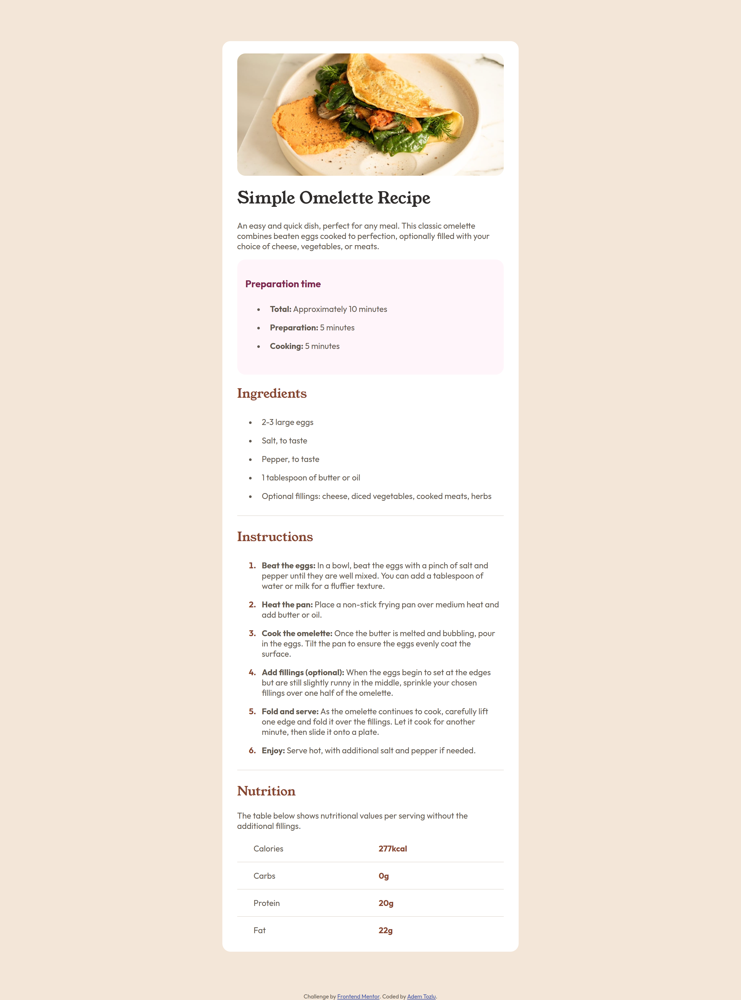

# Frontend Mentor – Rezeptseitenlösung

Dies ist eine Lösung für die [Recipe Page Challenge auf Frontend Mentor](https://www.frontendmentor.io/challenges/recipe-page-KiTsR8QQKm). Frontend-Mentor-Herausforderungen helfen Ihnen, Ihre Programmierfähigkeiten zu verbessern, indem Sie realistische Projekte erstellen.

## Inhaltsverzeichnis

- [Übersicht](#Übersicht)
  - [Screenshot](#screenshot)
  - [Links](#links)
- [Mein Prozess](#my-process)
  - [Erstellt mit](#built-with)
  - [Was ich gelernt habe](#what-i-learned)
  - [Fortsetzung der Entwicklung](#continued-development)
- [Autor](#Autor)

## Überblick

### Bildschirmfoto

### Links

- Lösungs-URL: [Github-Lösungen](https://github.com/Adem-Tozlu/Frontend-Mentor-Rezept)
- Live-Site-URL: [Website-Rezept Seite](https://frontend-mentor-rezept.vercel.app/)

## Mein Prozess

### Gebaut mit

- Semantisches HTML5-Markup
- Benutzerdefinierte CSS-Eigenschaften
- Flexbox
- Mobile-First-Workflow

### Was ich gelernt habe

Im Verlauf dieses Projekts habe ich meine Fähigkeiten in Flexbox weiterentwickelt und gelernt, sie effektiv anzuwenden. Darüber hinaus habe ich gelernt, wie ich die Nummerierung in einer geordneten Liste gestalten kann. Meine technischen Fähigkeiten habe ich erweitert und bin nun auch in der Lage, Feedback zu geben und anzunehmen, was sowohl für meine persönliche als auch berufliche Entwicklung äußerst wertvoll war.

### Weiterentwicklung

In Zukunft plane ich, meine Fähigkeiten im Bereich CSS weiter zu verbessern, insbesondere in Bezug auf Flexbox und Grid. Mein Ziel ist es, komplexere Websites zu erstellen und sie ansprechender zu gestalten. Darüber hinaus möchte ich auch an meinen Fähigkeiten in der Erstellung von Animationen arbeiten und mich in diesem Bereich weiterentwickeln. Aktuell bin ich auch dabei, Javascript zu lernen, um es in meinen Projekten einzusetzen.

## Autor

- Website - [Github](https://github.com/Adem-Tozlu)
- Frontend-Mentor – [@Adem-Tozlu](https://www.frontendmentor.io/profile/Adem-Tozlu)
- Linkedin - [@Adem-Tozlu](https://www.linkedin.com/in/adem-tozlu-8906b52a5)